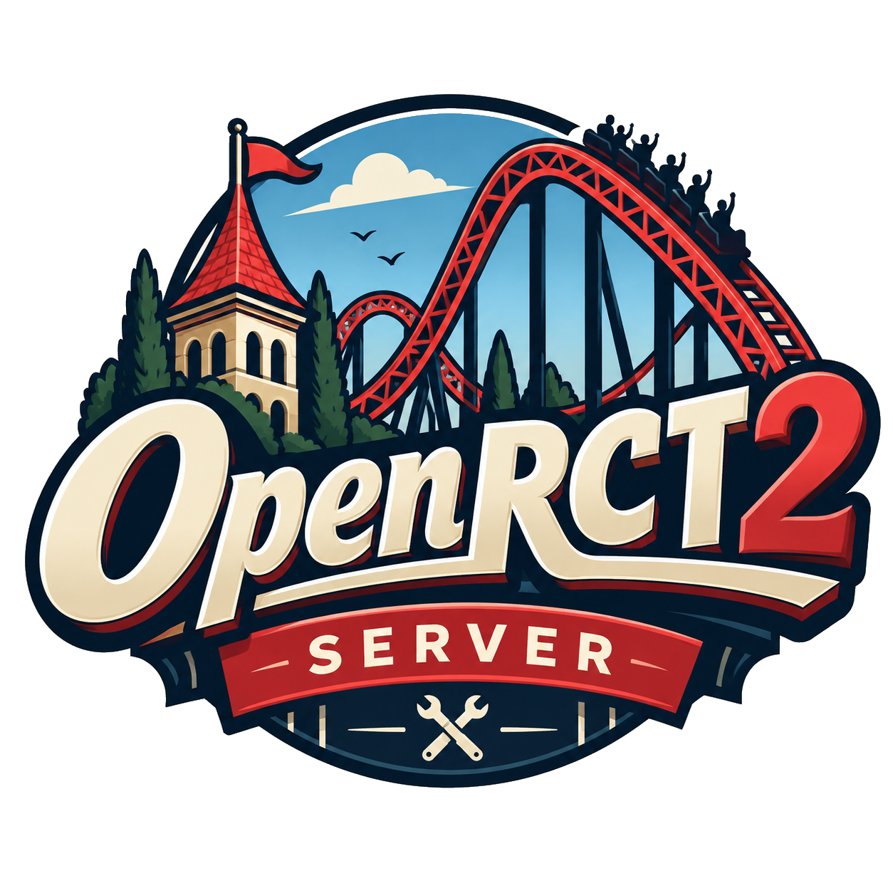

# OpenRCT2 Server Admin

<p align="center"></p>

Webverwaltung fuer einen dedizierten OpenRCT2-Multiplayerserver. Der Quellcode wird aus Git installiert; Originaldaten, Spielstaende, Backups und Zugangsdaten bleiben ausschliesslich im LXC.

Eine statische Design-Vorschau liegt unter [`docs/demo.html`](docs/demo.html). Fuer GitHub Pages den Ordner `docs/` als Verzeichnis der Pages-Quelle aktivieren.

## Dienste

| Dienst | Aufgabe | Port |
| --- | --- | --- |
| `admin` | Webinterface, API und Docker-Steuerung | `8088/tcp` |
| `openrct2` | OpenRCT2-Multiplayerserver | `11753/tcp` |

Port `11754` bleibt innerhalb des Gameserver-Containers und wird nicht veroeffentlicht.

## Funktionen

- Admin- und Public-Oberflaeche im OpenRCT2-Parkdesign mit lokal versioniertem Logo.
- Erststart-Wizard fuer Originaldaten, Spielstand und Servereinstellungen.
- Save-Upload, Auswahl, Loeschschutz des aktiven Saves und Backups.
- Start, Stopp, Neustart, aufklappbare Containerlogs und Preflight-Schutz.
- Parkansichten aus dem neuesten Autosave mit oeffentlicher Freigabe und Vollbildansicht.
- Gruppen- und Rechteverwaltung; Moderatorprofil ohne `passwordless_login` und `set_player_group`.
- Live-Parkdaten fuer Besucher, Geld, Werte und Parkrating; getrennt fuer die Public-Seite freigebbar.
- Optionaler Public-Infobereich, frei konfigurierbare Footer, Serveradresse und Branding-Upload.
- Manuelle Auswahl stabiler OpenRCT2-Container-Versionen mit Backup und Rollback.

## Alpine-LXC Voraussetzungen

- Alpine-LXC mit aktiviertem Docker-Nesting, mindestens 2 vCPU und 2 GB RAM.
- Eine erreichbare Git-Repository-URL.
- Ein sicheres Admin-Passwort.
- HTTP-Reverse-Proxy auf `<LXC-IP>:8088` und eine direkte TCP-Weiterleitung von `11753` auf den LXC. Ein normaler HTTP-Reverse-Proxy transportiert kein OpenRCT2-Multiplayer-Protokoll.

## Neuinstallation aus Git

Als `root` im LXC ausfuehren. Die Repository-URL wird bewusst als Argument uebergeben und nicht im Projekt fest verdrahtet.

```sh
apk add git
git clone <repository-url> /tmp/openrct2-admin
ADMIN_PASSWORD='<starkes-passwort>' /tmp/openrct2-admin/deploy/install-alpine-lxc.sh /opt/openrct2-admin <repository-url>
```

Das Skript installiert Docker und Git, klont das Repository, erzeugt eine nicht versionierte `.env`, erstellt die Laufzeitordner und startet das Webinterface. Anschliessend `/admin` im Browser oeffnen und den Erststart-Wizard durchlaufen:

1. Originale RCT2-Daten als ZIP hochladen.
2. Einen `.sv6`- oder `.park`-Spielstand hochladen.
3. Servername, Passwort und weitere Einstellungen speichern.
4. Den Server in der Verwaltung starten.

Die `.env` kann bei Bedarf um den externen Hostnamen ergaenzt werden:

```dotenv
PUBLIC_HOST=openrct2.example.com
PROJECT_URL=https://github.com/bripon76/openrct2-dedicated-server
```

## Bestehenden LXC auf Git umstellen

Wenn bereits ein manuell kopiertes Projekt unter `/opt/openrct2-admin` vorhanden ist, werden nur die versionierten Programmdateien durch Git ersetzt. Die ignorierten Laufzeitdaten unter `data/` und die `.env` bleiben dabei erhalten.

```sh
cd /opt/openrct2-admin
git init -b master
git remote add origin <repository-url>
git fetch origin master
git reset --hard origin/master
./deploy/update-alpine-lxc.sh
```

Vor einem Update kann die konfigurierte Repository-URL kontrolliert werden:

```sh
cd /opt/openrct2-admin
git remote get-url origin
git log -1 --oneline
```

## Update aus Git

Nach einem Push im LXC ausfuehren:

```sh
/opt/openrct2-admin/deploy/update-alpine-lxc.sh
```

Das Update holt `origin/master`, baut den Admincontainer neu und erstellt den Gameserver neu. Lief er vorher, wird er automatisch wieder gestartet. Nicht versionierte Laufzeitdaten unter `data/` und die `.env` bleiben erhalten.

`update-alpine-lxc.sh` fuehrt bereits `git fetch` und den Checkout von `origin/master` aus. Ein zusaetzliches `git pull` ist nicht erforderlich.

Fuer einen anderen Branch den Branch explizit setzen:

```sh
BRANCH=main /opt/openrct2-admin/deploy/update-alpine-lxc.sh
```

## Git-Info

Der laufende Versionsstand und das konfigurierte Remote-Repository lassen sich jederzeit im LXC anzeigen:

```sh
cd /opt/openrct2-admin
git log -1 --oneline
git status --short
git remote -v
```

Vor jedem Release werden die Git-Informationen in dieser Anleitung und die Update-Schritte mitgepflegt.

## Lokale Entwicklung

```sh
cp .env.example .env
# ADMIN_PASSWORD und SESSION_SECRET in .env setzen
docker compose -f docker-compose.live-mac.yml up -d --build admin
docker compose -f docker-compose.live-mac.yml --profile game create openrct2
```

Das Interface ist unter `http://localhost:8088/admin` erreichbar.

Zum lokalen Testen des laufenden Gameservers:

```text
OpenRCT2-Client: localhost:11753
```

Aktuelle Containerlogs:

```sh
docker compose -f docker-compose.live-mac.yml logs -f admin
docker compose -f docker-compose.live-mac.yml logs -f openrct2
```

## Multiplayer und mehrere Parks

Ein OpenRCT2-Gameserver hostet genau einen geladenen Park, kann aber mehrere Spieler gleichzeitig in diesem Park aufnehmen. Der aktuelle Admin verwaltet deshalb eine Gameserver-Instanz und einen aktiven Spielstand.

Mehrere Parks gleichzeitig sind moeglich, erfordern aber mehrere Gameserver-Instanzen. Die derzeitige Oberflaeche ist noch kein Mehrserver-Manager.

Die empfohlene Betriebsform ist ein LXC pro Park:

- Jeder LXC hat eine eigene Git-Installation, eigene `data/`-Laufzeitdaten und einen eigenen Adminzugang.
- Jeder Gameserver lauscht intern auf `11753/tcp`.
- Nach aussen braucht jeder Park einen eigenen TCP-Port, zum Beispiel `11753` und `11754`, die jeweils an `11753` des passenden LXC weitergeleitet werden.
- Ein HTTP-Reverse-Proxy kann pro Park eine eigene Webadresse auf den jeweiligen Adminport `8088` leiten, transportiert aber nicht das OpenRCT2-Multiplayer-Protokoll.

Alternativ koennen mehrere Compose-Projekte in einem LXC betrieben werden. Dafuer muessen pro Park eindeutige Container-Namen, Datenverzeichnisse, Adminports und Gameserverports konfiguriert werden. Eine zentrale Webverwaltung aller Instanzen ist dafuer als eigener Ausbau noetig.

## Laufzeitdaten

`data/` und `.env` sind absichtlich von Git ausgeschlossen. Sie enthalten urheberrechtlich geschuetzte RCT2-Dateien, Spielstaende, Backups, Screenshots sowie Secrets und duerfen nicht committed werden.

Auch hochgeladene Logos und Webeinstellungen liegen ausschliesslich unter `data/config/` und werden nicht versioniert.

## Pruefungen

```sh
python3 -m py_compile admin/app.py
docker compose config
docker compose ps
docker compose logs admin
```
